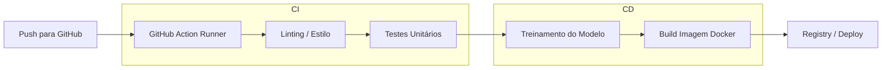

# CI/CD Básicos em MLOps — Guia do Apresentador

Este documento organiza a apresentação da aula e serve como **guia conceitual** para o expositor. 
A estrutura abaixo deve ser seguida para garantir clareza, progressão lógica e alinhamento com o grupo, focando na transição de processos manuais para a automação profissional.

---

## 1️⃣ Motivação

### 1.1 Por que isso importa para MLOps?

- **O Problema do "Funciona na Minha Máquina":** Versões de bibliotecas e ambientes diferentes silenciosamente alteram resultados de modelos.
- **Automação como Barreira de Qualidade:** O CI/CD é o contrato que diz: "este código prova seu valor a cada commit".
- **Proteção do Trabalho:** A automação não substitui o cientista de dados — ela protege o trabalho dele de falhas humanas e de infraestrutura.

### 1.2 O que o grupo vai sair sabendo fazer

- Diferenciar CI, Continuous Delivery e Continuous Deployment no contexto de ML.
- Compreender o princípio do **Shift Left** (trazer o teste para o início do processo).
- Ler e estruturar um pipeline básico no GitHub Actions (YAML).
- Garantir a **imutabilidade** do deploy através de imagens Docker geradas automaticamente.

### 1.3 Conexão com aulas anteriores

- **Aula anterior (Docker e Deploy):** Agora, o build da imagem Docker que fizemos manualmente passa a ser automático.
- **Preparação para o Futuro:** Este pipeline de *software* é a base para o pipeline de *modelo* (re-treinamento, drift e model registry) que veremos adiante.

---

## 2️⃣ Como Funciona

### 2.1 CI/CD — Os Pilares

- **CI (Integração Contínua):** Feedback rápido. Testes a cada push para impedir bugs de lógica ou pré-processamento.
- **CD (Entrega/Deploy Contínuo):** Transformação do código testado em um **Artefato de Produção** (Imagem Docker).
- **Delivery vs. Deployment:** 
    - *Delivery:* Pronto para ir ao ar, aguarda aprovação (comum em ML para validação humana).
    - *Deployment:* 100% automático para produção.

### 2.2 O Princípio do "Shift Left" e Imutabilidade

- **Shift Left:** Identificar que o Docker não builda ou que o código quebrou **antes** de gastar recursos caros de Nuvem.
- **Imutabilidade:** Uma imagem Docker gerada e testada nunca é alterada. Mudanças geram novas imagens (tags), criando uma trilha de auditoria perfeita.

### 2.3 CI/CD de Software vs. MLOps (A distinção fundamental)

| Componente | Software Tradicional | MLOps |
| :--- | :--- | :--- |
| **Gatilho** | Alteração no Código | Código, **Dados ou Drift** |
| **Teste** | Unitário, Integração | + Validação de Dados + Performance |
| **Métrica** | Cobertura de Código | Acurácia, F1-Score, Latência |

### 2.4 Anatomia do GitHub Actions

- **Workflow:** O arquivo YAML que define o processo.
- **Events:** Gatilhos (`push`, `pull_request`).
- **Runner:** A máquina virtual efêmera (ex: `ubuntu-latest`) que executa os comandos.
- **Jobs & Steps:** A sequência lógica: Checkout -> Setup -> Install -> Test -> Build.

### 2.5 Gerenciamento de Secrets no Pipeline

- **Nunca** colocar chaves de API no YAML.
- Usar **GitHub Secrets** para injetar credenciais de Nuvem ou tokens de API de forma segura durante a execução do Job.

---

## 3️⃣ Quickstart

### 3.1 Prática: "O Pipeline Inquebrável"

**Objetivo:** Configurar um pipeline no GitHub Actions que valide o código, treine o modelo e gere a imagem Docker automaticamente.

**Repositórios e referências de apoio:**
- [GitHub Actions Documentation](https://docs.github.com/pt/actions) — Referência de sintaxe YAML.
- [Pytest Docs](https://docs.pytest.org/) — Para entender os testes de unidade no pipeline.

### 3.2 Arquitetura da prática



### 3.3 Objetivos da Prática

**Fase 1: Executar e Entender**
- Subir a estrutura da pasta `atividade` para um repositório novo.
- Criar o diretório `.github/workflows/` e o arquivo `ci.yaml`.
- Observar a execução em tempo real na aba **Actions**.

**Fase 2: O Feedback do Erro (Fail Fast)**
- Introduzir um erro proposital (ex: erro de indentação ou falha no `assert` do modelo).
- Verificar como o pipeline bloqueia o progresso e protege a `main`.

**Fase 3: Rastreabilidade**
- Observar como cada build gera um log detalhado e um artefato pronto.

### 3.4 Exemplo de Pipeline Mínimo (GitHub Actions)

```yaml
name: CI/CD Básico MLOps
on: [push, pull_request]

jobs:
  qualidade-e-build:
    runs-on: ubuntu-latest
    steps:
      - uses: actions/checkout@v3
      - name: Setup Python
        uses: actions/setup-python@v4
        with: {python-version: '3.10'}
      
      - name: Install & Lint
        run: |
          pip install -r requirements.txt
          flake8 src/
      
      - name: Test & Build
        run: |
          pytest tests/
          docker build -t ml-app-ufg:latest .
```

---

## 4️⃣ Quando Usar (e Quando NÃO Usar)

### Usar ✅
- Projetos colaborativos onde múltiplos membros mexem no código.
- Sistemas que precisam de deploys frequentes e confiáveis em produção.
- Quando o custo de um erro em produção é alto (perda de performance ou downtime).
- Para garantir que o ambiente de treinamento seja idêntico ao de predição.

### Não usar ❌
- Prototipagem inicial/exploratória solitária (Notebooks locais).
- Scripts de uso único que não serão deployados ou compartilhados.
- Quando a infraestrutura de CI/CD adiciona mais complexidade que o benefício (em estágios muito iniciais de POC).

> **Regra prática:** Se o projeto saiu do Notebook e virou um script/API que outros vão usar, ele **precisa** de um pipeline de CI básico.